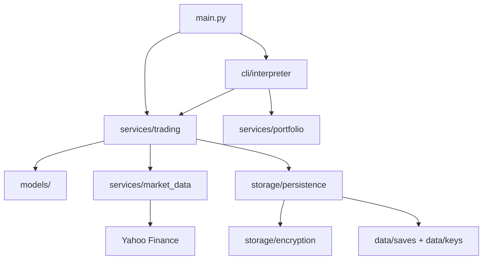

# Stock Simulator

A production-quality command-line stock trading simulator built in Python. Trade virtual stocks using live market data from Yahoo Finance, manage limit orders, track portfolio performance, and persist encrypted save files locally.

## Features

- **User accounts** with encrypted local persistence
- **Market and limit orders** for buying and selling
- **Background order execution** while the simulator runs
- **Retroactive order fills** for orders that trigger while offline
- **Portfolio analytics** — total value, cash, holdings value, unrealized/realized P&L
- **Cost basis tracking** with average purchase price per holding
- **Transaction history** and order history with timestamps
- **Thread-safe market data caching** (15-minute TTL) to reduce API calls
- **Atomic save operations** to prevent data corruption on crash
- **Structured logging** to `logs/`

## Installation

```bash
git clone <repository-url>
cd Stock-Market-Sim
pip install -r requirements.txt
```

**Requirements:** Python 3.10+

## Usage

```bash
python -m stock_simulator.main
```

On first launch, enter a username (3–32 alphanumeric characters) and starting balance. Returning users are loaded automatically from encrypted save files.

### Commands

| Command | Description |
|---------|-------------|
| `buy SYMBOL QTY [PRICE]` | Buy shares at market price (omit PRICE) or place a limit buy |
| `sell SYMBOL QTY [PRICE]` | Sell shares at market price or place a limit sell |
| `cancel buy\|sell NUMBER` | Cancel a pending order (see numbers in `portfolio`) |
| `portfolio` | Show holdings, pending orders, and P&L analytics |
| `cash` | Show cash balance (total and available) |
| `price SYMBOL` | Show current stock price |
| `history [N]` | Show last N transactions (default 10) |
| `orders [N]` | Show last N completed/cancelled orders (default 10) |
| `help` | Show command reference |
| `quit` / `exit` | Save and exit |

**Example session:**

```
> buy AAPL 10
Total price will be $1750.00. Confirm? (Y/N)
> Y

> portfolio
PORTFOLIO
BALANCE: $8250.00 (available: $8250.00)
HOLDINGS VALUE: $1750.00
TOTAL VALUE: $10000.00
...
```

## Running Tests

```bash
python -m pytest stock_simulator/tests -v
```

Tests use mocked market data — no live Yahoo Finance calls required.

## Architecture

```
stock_simulator/
├── main.py              # CLI entry point, threading, user onboarding
├── models/              # User, Order, Holding, Transaction, StockQuote
├── services/
│   ├── market_data.py   # Yahoo Finance integration + cache
│   ├── trading.py       # Buy/sell/order execution logic
│   └── portfolio.py     # Analytics and display
├── storage/
│   ├── persistence.py   # Atomic save/load with schema versioning
│   └── encryption.py    # Fernet encryption, separate key storage
├── cli/
│   └── interpreter.py   # Command parsing and validation
├── utils/
│   ├── validation.py    # Username and input sanitization
│   ├── logging_config.py
│   └── paths.py         # Runtime directory paths
├── tests/               # pytest test suite
├── data/                # Runtime: saves/ and keys/ (gitignored)
└── logs/                # Runtime logs (gitignored)
```



## Design Decisions

### Threading
Two threads run concurrently: one processes user commands, one checks pending orders every 3 seconds. A shared lock protects state mutations only — user input is **not** held under the lock, so orders can execute while you type.

### Encryption
User save files are encrypted with Fernet (AES-128). Encryption keys are stored in a **separate** `data/keys/` directory from ciphertext in `data/saves/`, with restricted file permissions. Legacy saves from the original project layout are migrated automatically on first load.

### Caching
Stock quotes are cached in memory for 15 minutes per symbol. The cache is protected by a threading lock and returns a typed `StockQuote` dataclass to prevent price field confusion.

### Save Format Versioning
- **v1** (legacy): balance, stocks, sell orders, buy orders
- **v2** (current): adds realized P&L, cost basis, transaction history, order history

Existing v1 saves load without modification and upgrade to v2 on the next save.

## Known Limitations

- Market data depends on Yahoo Finance availability and rate limits
- Price data uses 5-minute intervals for historical ranges; real-time prices may lag slightly
- Only US exchange symbols reliably supported (NASDAQ/NYSE)
- Retroactive offline order fills use min/max price over the offline period — an approximation, not tick-level execution
- Encryption protects data at rest but keys are stored locally; this is not suitable for high-security environments without additional key management

## Future Improvements

- Web-based UI or REST API
- Watchlists and price alerts
- Portfolio performance charts
- Password-derived encryption keys
- CI/CD pipeline with GitHub Actions
- Docker containerization
